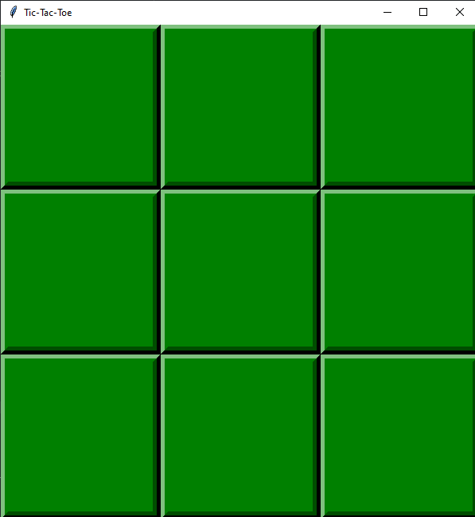
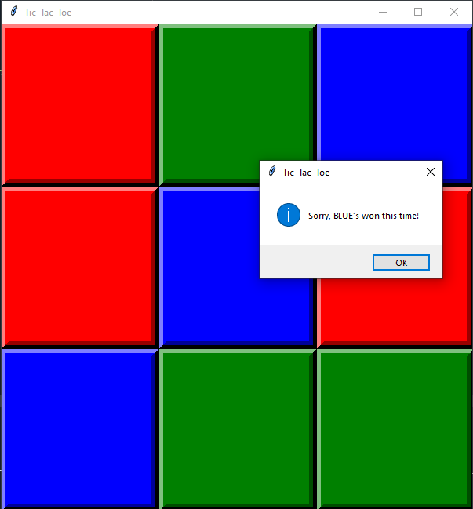
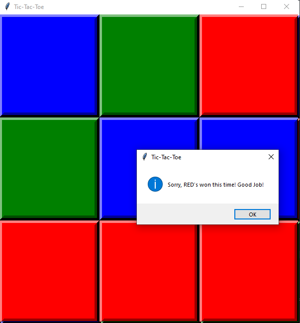
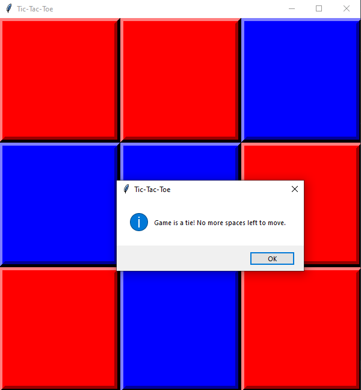

# Tic-Tac-Toe játék, mesterséges intelligenciával
##Bevezető
A program egy egyszerű Tic-Tac-Toe játék, amely során a számítógép ellen játszhatunk. A számítógép egy egyszerű algoritmus alapján dönt a saját lépéséről.

A következő funkciók lettek megvalósítva:
* A játékos a saját körében képes lépni egyet
* A számítógép válaszol a játékos lépésére
* A program ellenőrzi, hogy nyert-e valaki, döntetlen-e és ezt ki is írja
* A játék végén kiírja az eredményt és reseteli a táblát

A projekt egy .py filet tartalmaz.

használt könyvtárak:
* import random
* from tkinter import *
* import tkinter.messagebox

### A képernyő kirajzolása

Legelső lépés a tábla létrehozása.
```python
board = [' ' for x in range(9)]
```
Ezt követően következik a képernyő kirajzolása.
A képernyő 9db gombból áll, amely a lépéseket reprezentálja.

 

```python
def main_screen(): 
    
    global screen
    screen = Tk()
    screen.title('Tic-Tac-Toe')
    screen.geometry("600x620")
    global fields
    fields = []
    
    for i in range(0,9):
        fields.append(Button(screen, text = " ",  height = "12", width = "25", borderwidth = 10, bg = "green", command = lambda i=i : [drawMove(fields[i]),main()]))
        fields[i].grid(row = i // 3, column = i % 3 )

    screen.mainloop()
```

### Lépések kirajzolása
A lépesek során ez a függvény hívodik meg, s ez rajzolja ki az adott lépést, mind a számítógép, mind a játékos esetében.

```python
def drawMove(field, XO = "X", color = "red"):
      
    if XO == 'X' and field['bg'] == "green":
        field.config(bg = color)
        j = fields.index(field)
        board[j] = XO
        global compTurn
        compTurn = True

    if XO == 'O':  
        j = fields.index(field)
        board[j] = XO
        field.config(bg = color)
        if isWinner(board, 'O'):
            messagebox.showinfo('Tic-Tac-Toe', 'Sorry, BLUE\'s won this time!')
            resetBoard()
        compTurn = False
```
### A számítógép lépése

A számítógép egy egyszerú algoritmus alapján dönti el, hogy hova szeretne lépni. Először megnézi, hogy van-e olyan mező, ahol ő tud nyerni, majd van-e olyan mező ahol a játékos tud nyerni. Ha van akkor ide rak, ha nincs akkor ha szabad a középső mező, akkor azt választja, ha nem szabad, akkor sarokra probál rakni, ha az se szabad, akkor a szélére.


```python
def compMove():
    possibleMoves = [x for x, letter in enumerate(board) if letter == ' ']
    
    #Check for possible winning move to take or to block opponents winning move
    for let in ['O', 'X']:
        for i in possibleMoves:
            boardCopy = board[:]
            boardCopy[i] = let
            if isWinner(boardCopy, let):
                move = i
                return move
    
    #Try to take the center    
    if 4 in possibleMoves:
        move = 4
        return move
    
    
    #Try to take one of the corners        
    cornersOpen = []
    for i in possibleMoves:
        if i in [0,2,6,8]:
            cornersOpen.append(i)
        
        if len(cornersOpen) > 0:
            move = selectRandom(cornersOpen)
            return move
    
    #Take any edge    
    edgesOpen = []
    for i in possibleMoves:
        if i in [0,2,6,8]:
            edgesOpen.append(i)
    
        if len(edgesOpen) > 0:
            move = selectRandom(edgesOpen)
        else:    
            move = selectRandom(possibleMoves)
    
    return move
```
A program folyamatosan ellenőrzi, hogy nyert-e valaki, vagy elfogytak-e a szabad helyek, így döntetlen-e.

 

 



```python
def isWinner(bo, le):
    return ((bo[0] == le and bo[1] == le and bo[2] == le) or 
    (bo[3] == le and bo[4] == le and bo[5] == le) or # across the middle
    (bo[6] == le and bo[7] == le and bo[8] == le) or # across the bottom
    (bo[0] == le and bo[3] == le and bo[6] == le) or # down the left side
    (bo[1] == le and bo[4] == le and bo[7] == le) or # down the middle
    (bo[2] == le and bo[5] == le and bo[8] == le) or # down the right side
    (bo[2] == le and bo[4] == le and bo[6] == le) or # diagonal
    (bo[0] == le and bo[4] == le and bo[8] == le)) # diagonal
    
def isBoardFull(board):
    if board.count(' ') > 1:
        return False
    else:
        return True    
```

Ha valaki nyert, vagy döntetlen lett, akkor a játéknak vége és reseteli a táblát egy újabb játékra.

```python
def resetBoard():
    global board 
    board = [' ' for x in range(9)]
    screen.destroy()
    main_screen()
```
